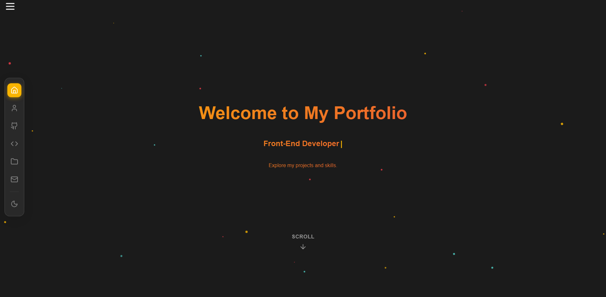

# 🌟 Kareem Ahmed - Portfolio

> **A modern, responsive portfolio showcasing my journey as a Computer Science student and developer**

[](https://kareemh-1.github.io/Portfolio/)
[](https://github.com/KareemH-1)

## 📸 Preview


*Clean, modern design with dark/light theme support*

## ✨ Features

🎨 **Modern UI/UX**
- Clean, professional design
- Smooth animations and transitions
- Interactive hover effects

📱 **Responsive Design**
- Mobile-first approach
- Works perfectly on all devices
- Collapsible sidebar for mobile

🌙 **Theme System**
- Dark/Light mode toggle
- Saves user preference
- Consistent theming across all components

🔧 **Interactive Elements**
- Project filtering by category
- Skills filtering system
- GitHub stats integration
- Certificate gallery with modal view

⚡ **Performance**
- Optimized loading
- SEO-friendly meta tags
- Social media integration

## 🛠️ Tech Stack

```
Frontend:     HTML, CSS, JavaScript
Icons:        Lucide Icons, DevIcons
APIs:         GitHub Stats APIs
Features:     Responsive Design, Theme Toggle, Local Storage
```

## 🎯 Sections

| Section | Description |
|---------|-------------|
| **Home** | Interactive typewriter effect with scroll indicator |
| **About** | Personal info, skills summary, and background |
| **GitHub Stats** | Live GitHub statistics and contribution graph |
| **Skills** | Interactive skill cards with filtering |
| **Achievements** | Certificate gallery with modal previews |
| **Projects** | Portfolio projects with live links |
| **Contact** | Multiple ways to get in touch |

## 📱 Quick Start

```bash
# Clone the repository
git clone https://github.com/KareemH-1/Portfolio_Real.git

# Navigate to project
cd Portfolio_Real

# Open in browser
open index.html
```

## 🚀 Live Demo

**[👉 View Portfolio](https://kareemh-1.github.io/Portfolio_Real/)**

## � Let's Connect

[](mailto:kareem.a.hassan15@gmail.com)
[](https://www.linkedin.com/in/kareem-ahmed-4bbbb9376/)
[](https://codeforces.com/profile/KareemH)

---

<div align="center">

**⭐ If you like this portfolio, give it a star!**

*Built with ❤️ by [Kareem Ahmed](https://github.com/KareemH-1)*

</div>
